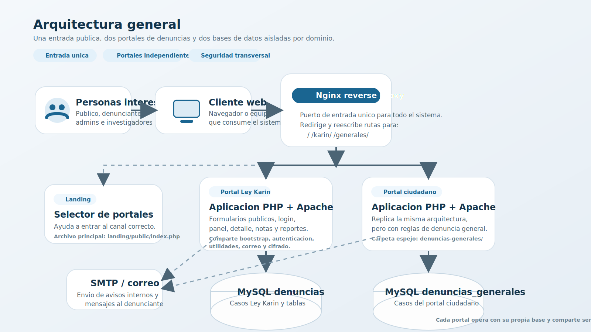
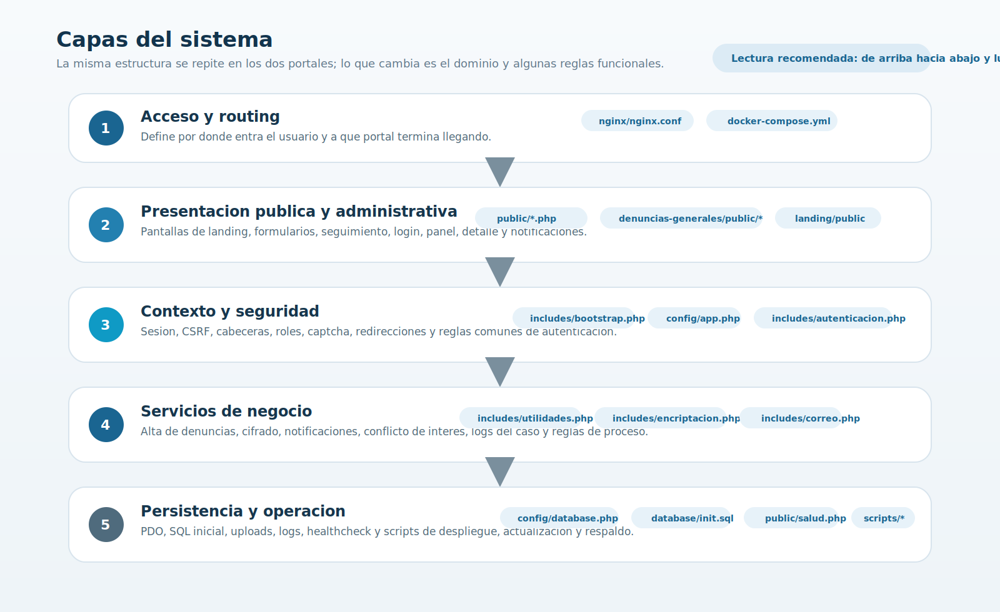
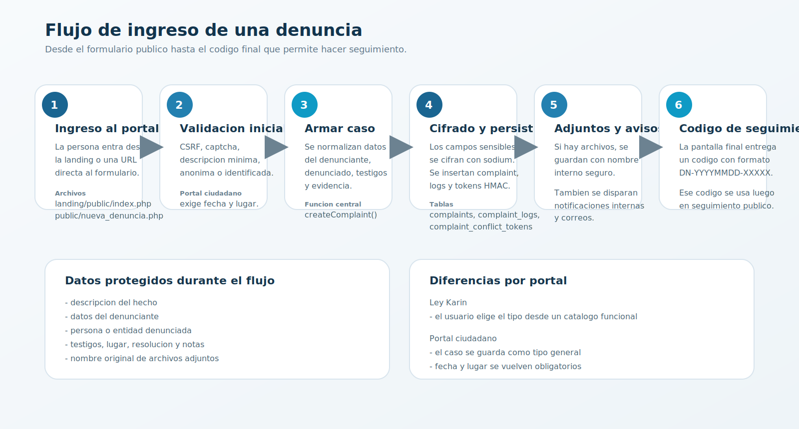
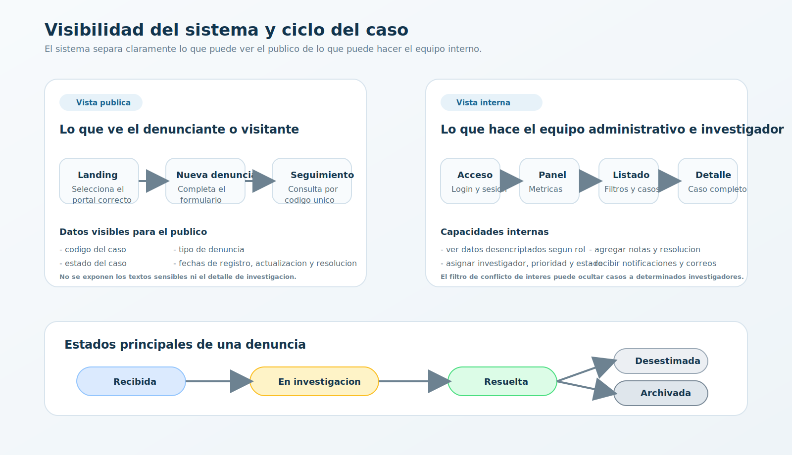

# Guia de arquitectura, capas y procesos

Este documento resume como funciona la plataforma de denuncias segun la implementacion actual del repositorio. La idea es que cualquier persona interesada pueda entender la solucion sin tener que recorrer primero todo el codigo.

## 1. Resumen ejecutivo

La plataforma esta compuesta por tres piezas visibles y varias capas internas:

- Una landing publica que ayuda a elegir el portal correcto.
- Un portal Ley Karin en la ruta `/karin/`.
- Un portal ciudadano en la ruta `/generales/`.

Ambos portales comparten la misma idea tecnica:

- Exponer formularios publicos para recibir denuncias.
- Guardar la informacion sensible cifrada en base de datos.
- Permitir seguimiento por codigo de denuncia.
- Dar acceso a un backoffice con login, panel, gestion de casos, notas y notificaciones.

## 2. Vista general de la solucion

### Que se ve en esta imagen

- Todo el trafico entra por Nginx, que actua como punto de acceso unico.
- La landing solo orienta al usuario; no procesa denuncias ni usa base de datos.
- Cada portal de denuncias tiene su propia aplicacion PHP/Apache y su propia base MySQL.
- El correo se usa como servicio transversal para avisos internos y mensajes al denunciante cuando corresponde.

Archivos clave de esta capa:

- [docker-compose.yml](../docker-compose.yml)
- [nginx/nginx.conf](../nginx/nginx.conf)
- [landing/public/index.php](../landing/public/index.php)
- [Dockerfile](../Dockerfile)

## 3. Capas del sistema

La solucion puede leerse por capas, desde la experiencia visible hasta la operacion:

| Capa | Proposito | Archivos principales |
|---|---|---|
| Acceso y enrutamiento | Recibir trafico y enviarlo al portal correcto | [nginx/nginx.conf](../nginx/nginx.conf), [docker-compose.yml](../docker-compose.yml) |
| Presentacion publica | Landing, inicio, nueva denuncia, seguimiento | [public/index.php](../public/index.php), [public/nueva_denuncia.php](../public/nueva_denuncia.php), [public/seguimiento.php](../public/seguimiento.php), [denuncias-generales/public/nueva_denuncia.php](../denuncias-generales/public/nueva_denuncia.php) |
| Presentacion administrativa | Login, panel, listado, detalle, notificaciones | [public/acceso.php](../public/acceso.php), [public/panel.php](../public/panel.php), [public/denuncias_admin.php](../public/denuncias_admin.php), [public/detalle_denuncia.php](../public/detalle_denuncia.php), [public/notificaciones.php](../public/notificaciones.php) |
| Contexto y seguridad | Sesion, cabeceras, CSRF, autenticacion, captcha | [includes/bootstrap.php](../includes/bootstrap.php), [config/app.php](../config/app.php), [includes/autenticacion.php](../includes/autenticacion.php), [includes/captcha.php](../includes/captcha.php) |
| Dominio y servicios | Crear denuncias, cifrar, notificar, auditar | [includes/utilidades.php](../includes/utilidades.php), [includes/encriptacion.php](../includes/encriptacion.php), [includes/correo.php](../includes/correo.php) |
| Persistencia y operacion | PDO, SQL inicial, healthcheck, backups, actualizaciones | [config/database.php](../config/database.php), [database/init.sql](../database/init.sql), [public/salud.php](../public/salud.php), [scripts/backup-db.sh](../scripts/backup-db.sh), [scripts/update.sh](../scripts/update.sh) |

### Idea central

La capa mas importante para entender el sistema es la combinacion de:

- [includes/bootstrap.php](../includes/bootstrap.php), que arma el contexto base.
- [includes/utilidades.php](../includes/utilidades.php), que concentra gran parte de la logica de negocio.
- [includes/encriptacion.php](../includes/encriptacion.php), que protege los datos sensibles.

## 4. Flujo principal: ingreso de una denuncia

Este es el recorrido mas importante de la plataforma.

### Paso 1. La persona llega al portal correcto

La landing en [landing/public/index.php](../landing/public/index.php) separa el uso entre:

- Ley Karin: materias de acoso, violencia o discriminacion laboral.
- Portal ciudadano: denuncias generales o institucionales.

### Paso 2. El formulario aplica validaciones iniciales

En [public/nueva_denuncia.php](../public/nueva_denuncia.php) y [denuncias-generales/public/nueva_denuncia.php](../denuncias-generales/public/nueva_denuncia.php) se valida:

- Token CSRF.
- Captcha.
- Largo minimo de la descripcion.
- Si la denuncia sera anonima o identificada.
- Reglas particulares del portal.

Diferencias importantes:

- En Ley Karin se elige un tipo de denuncia desde un catalogo fijo.
- En portal ciudadano el tipo se guarda como `general` y se exige fecha y lugar del incidente.

### Paso 3. Se arma la estructura de negocio

El formulario construye un arreglo de datos con:

- Tipo de denuncia.
- Descripcion.
- Datos del denunciante si la denuncia no es anonima.
- Datos de la persona o entidad denunciada.
- Testigos, fecha, lugar y descripcion de evidencia.

### Paso 4. Se cifran los campos sensibles

[includes/utilidades.php](../includes/utilidades.php) llama a [includes/encriptacion.php](../includes/encriptacion.php) para cifrar datos sensibles con libsodium.

Se protegen, entre otros:

- Descripcion de los hechos.
- Datos del denunciante.
- Datos de la persona denunciada.
- Testigos.
- Lugar del incidente.
- Resolucion y notas posteriores.

Ademas, se generan HMACs de algunos campos para soportar el filtro de conflicto de interes sin exponer el dato en texto plano.

### Paso 5. Se persiste la denuncia

La funcion `createComplaint()`:

- Genera un codigo de denuncia con formato `DN-YYYYMMDD-XXXXX`.
- Inserta el registro principal en `complaints`.
- Inserta tokens de conflicto en `complaint_conflict_tokens`.
- Registra el primer evento en `complaint_logs`.

Si la persona adjunta archivos, `saveComplaintAttachments()`:

- Valida tipo de archivo.
- Genera un nombre interno seguro.
- Guarda el archivo en `public/uploads/evidencia/`.
- Cifra el nombre original antes de persistirlo.

### Paso 6. Se notifican actores internos y, si aplica, el denunciante

Despues del alta:

- Se registra actividad en `activity_logs`.
- Se crean notificaciones en `notifications`.
- Se pueden enviar correos via [includes/correo.php](../includes/correo.php).

### Paso 7. Se entrega el codigo de seguimiento

La persona usuaria recibe un codigo unico. Ese codigo es la llave para consultar el estado mas adelante desde [public/seguimiento.php](../public/seguimiento.php).

## 5. Flujo de seguimiento publico

El seguimiento es deliberadamente mas limitado que el backoffice.

### Como funciona

- La persona ingresa un codigo en [public/seguimiento.php](../public/seguimiento.php).
- La consulta busca por `complaint_number`.
- Se registra auditoria de la consulta en `activity_logs`.
- Se aplica rate limiting por IP para frenar abuso.

### Que informacion se muestra

Se exponen solo datos operativos de alto nivel:

- Codigo.
- Tipo.
- Estado.
- Modalidad anonima o identificada.
- Fechas de registro, actualizacion y resolucion.

No se muestran los campos sensibles del caso al publico.

## 6. Flujo administrativo y de investigacion

El backoffice vive en el mismo portal, pero bajo acceso autenticado.

### 6.1. Login y sesion

En [public/acceso.php](../public/acceso.php) el sistema:

- Permite ingresar con email o username.
- Limita intentos fallidos por IP.
- Bloquea usuarios despues de multiples errores.
- Regenera el identificador de sesion para evitar session fixation.

La logica principal esta en [includes/autenticacion.php](../includes/autenticacion.php).

### 6.2. Cambio obligatorio de contrasena

Si el usuario tiene `must_change_password = 1`, se fuerza el paso por [public/cambiar_contrasena.php](../public/cambiar_contrasena.php).

Las reglas minimas son:

- Largo minimo.
- Mayuscula.
- Minuscula.
- Numero.
- Caracter especial.
- No reutilizar la misma contrasena.

### 6.3. Panel y listado de casos

En [public/panel.php](../public/panel.php) se construyen metricas y graficos para el equipo interno.

En [public/denuncias_admin.php](../public/denuncias_admin.php) y [public/panel.php](../public/panel.php) aparece una regla importante: el filtro de conflicto de interes.

Ese filtro evita que un investigador vea casos donde podria estar implicado como denunciado, usando HMACs y tokens en lugar de comparar datos desencriptados.

### 6.4. Detalle del caso

[public/detalle_denuncia.php](../public/detalle_denuncia.php) es la vista mas sensible del sistema. Desde aqui se puede:

- Ver los campos desencriptados.
- Asignar investigador.
- Cambiar estado.
- Cambiar prioridad.
- Agregar notas de investigacion cifradas.
- Registrar resolucion.
- Consultar historial del caso.

### 6.5. Notificaciones y auditoria

Cuando se asigna un caso o cambia su estado, el sistema puede:

- Insertar notificaciones internas.
- Enviar correo a personas suscritas.
- Registrar actividad y trazabilidad.

La gestion de suscripciones y el centro de notificaciones se maneja en [public/notificaciones.php](../public/notificaciones.php).

## 7. Seguridad y confidencialidad

La seguridad no esta concentrada en un solo archivo; esta distribuida en varias capas.

### Controles visibles en el codigo

- Cabeceras de seguridad HTTP en [includes/bootstrap.php](../includes/bootstrap.php).
- Politica CSP para scripts, estilos, fuentes e imagenes.
- CSRF tokens en formularios.
- Captcha en formularios publicos.
- Rate limiting en login y seguimiento.
- Cifrado de datos sensibles con libsodium en [includes/encriptacion.php](../includes/encriptacion.php).
- Control por roles en [includes/autenticacion.php](../includes/autenticacion.php).
- Trazabilidad en `activity_logs` y `complaint_logs`.

### Regla funcional importante

El sistema esta disenado para que:

- La base de datos guarde los datos sensibles cifrados.
- El publico vea solo el estado del caso.
- El desencriptado ocurra dentro de la aplicacion y solo para roles autorizados.

## 8. Modelo de datos que conviene conocer primero

| Tabla | Rol en el sistema | Observacion |
|---|---|---|
| `users` | Usuarios internos y roles | Guarda login, rol y politicas de bloqueo |
| `complaints` | Caso principal | Mezcla metadatos operativos con campos cifrados |
| `complaint_attachments` | Archivos adjuntos | Guarda ruta interna y nombre original cifrado |
| `complaint_conflict_tokens` | Conflicto de interes | Permite exclusiones sin leer texto plano |
| `complaint_logs` | Historial del caso | Puede almacenar descripciones cifradas |
| `investigation_notes` | Notas de investigacion | Siempre orientadas a backoffice |
| `activity_logs` | Auditoria general | Login, consultas, cambios y acciones |
| `notifications` | Bandeja de notificaciones | Se complementa con grupos y suscripciones |
| `password_resets` | Recuperacion de acceso | Soporte operativo adicional |

Archivos base de datos:

- [database/init.sql](../database/init.sql)
- [denuncias-generales/database/init.sql](../denuncias-generales/database/init.sql)

## 9. Diferencias entre los dos portales

| Tema | Portal Ley Karin | Portal Ciudadano |
|---|---|---|
| Ruta | `/karin/` | `/generales/` |
| Foco | Acoso, violencia y discriminacion laboral | Denuncias generales e institucionales |
| Tipos | Catalogo fijo en configuracion | Tipo generico `general` |
| Validaciones destacadas | Tipo de denuncia obligatorio | Fecha y lugar obligatorios |
| Base de datos | `denuncias` | `denuncias_generales` |
| Estructura de carpetas | Raiz del repositorio | Replica en `denuncias-generales/` |

En terminos de arquitectura, ambos portales son casi gemelos: cambia el contexto funcional, algunas reglas y su base de datos.

## 10. Despliegue y operacion

### Servicios levantados con Docker Compose

- `nginx`: punto de entrada unico.
- `landing`: selector de portales.
- `app`: portal Ley Karin.
- `db`: base de datos Ley Karin.
- `app-generales`: portal ciudadano.
- `db-generales`: base de datos portal ciudadano.
- `phpmyadmin`: apoyo de desarrollo, no pensado para exponer en produccion.

### Scripts utiles

- [start.sh](../start.sh): genera entorno y levanta contenedores.
- [scripts/update.sh](../scripts/update.sh): actualiza versiones y puede reconstruir servicios.
- [scripts/backup-db.sh](../scripts/backup-db.sh): genera respaldos de bases de datos.

### Healthcheck

[public/salud.php](../public/salud.php) entrega una respuesta JSON simple y, si se solicita, puede comprobar conectividad con la base de datos. El detalle de salud puede protegerse con `HEALTH_CHECK_TOKEN`.

## 11. Ruta recomendada para leer el codigo

Si una persona quiere profundizar sin perderse, esta secuencia funciona bien:

1. [README.md](../README.md)
2. [docker-compose.yml](../docker-compose.yml)
3. [nginx/nginx.conf](../nginx/nginx.conf)
4. [includes/bootstrap.php](../includes/bootstrap.php)
5. [config/app.php](../config/app.php)
6. [includes/utilidades.php](../includes/utilidades.php)
7. [public/nueva_denuncia.php](../public/nueva_denuncia.php)
8. [public/seguimiento.php](../public/seguimiento.php)
9. [public/acceso.php](../public/acceso.php)
10. [public/panel.php](../public/panel.php)
11. [public/detalle_denuncia.php](../public/detalle_denuncia.php)
12. [public/notificaciones.php](../public/notificaciones.php)

## 12. Idea final

La plataforma no es solo un formulario web. En realidad es un sistema de procesamiento de casos con tres propiedades principales:

- Separacion de portales segun el tipo de denuncia.
- Proteccion fuerte de datos sensibles dentro del flujo de negocio.
- Trazabilidad operacional para seguimiento, investigacion y resolucion.

Visto por capas, el proyecto queda mas simple de entender:

- Nginx decide a que portal entra el usuario.
- PHP presenta formularios y paneles.
- Los includes comparten autenticacion, cifrado y reglas de negocio.
- MySQL guarda metadatos operativos y datos sensibles cifrados.
- Docker empaqueta y opera todo como una sola plataforma.